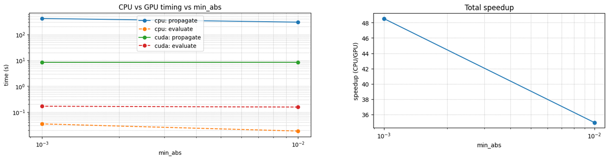

# Pauli Propagation Surrogate (Tensor)
GPU-accelerated Pauli-propagation surrogate with a tensor backend.

This repository is currently intended to be run **from source** (e.g. the Tutorial notebooks).
It does **not** ship a Python package metadata file (`pyproject.toml` / `setup.py`) in this workspace,
so installation is handled via a dedicated conda environment + running from the repo root.


## Summary
### Overview
**Pauli Propagation** is a modern methodology for accelerating quantum simulation by shifting from the Schrödinger picture to the Heisenberg picture. Instead of evolving quantum states, it backward-propagates observables through the circuit, tracking only the gates that affect the measurement outcome. This eliminates unnecessary computation and enables efficient, fast simulation. The approach has gained renewed attention since 2025, but existing implementations were limited: CPU-only SDKs suffered from speed bottlenecks, while GPU-accelerated versions lacked reliable support for gradient-based learning.

We developed a **GPU-accelerated, differentiable Pauli Propagation SDK** using novel data structures that enable both high-performance computation and seamless integration with modern optimization frameworks (e.g., PyTorch).

**Pauli Propagation Surrogate (PPS)** addresses the exponential term explosion problem inherent in Pauli Propagation by introducing controlled truncation strategies with acceptable approximation error. Our implementation includes:
- **Max-weight truncation**: limits term complexity by Pauli operator count
- **Coefficient truncation**: filters terms by magnitude
- **Max-XY truncation**: custom strategy for balancing accuracy and performance

Internal benchmarks demonstrate stable training and optimization on problems as large as **35-qubit QAOA**, showing that PPS scales effectively to practical quantum machine learning workloads.

### Why is it needed?
Traditional quantum simulation approaches face critical bottlenecks in variational quantum algorithms:
- **Repeated circuit evaluation** in VQE/QAOA-style workflows becomes prohibitively expensive
- **CPU-only implementations** limit iteration speed during model prototyping
- **Lack of automatic differentiation** in existing GPU tools hinders integration with ML pipelines

Our tensor-based Pauli Propagation approach solves these issues by:
- **Eliminating redundant computation** via Heisenberg-picture propagation
- **Leveraging GPU parallelism** with sparse tensor operations optimized for CUDA
- **Enabling gradient-based learning** through native PyTorch integration
- **Scaling to larger problems** via intelligent truncation that preserves accuracy

### Context: where this fits in modern QML
Many near-term quantum algorithms (e.g., VQE/QAOA-style workflows) are **hybrid**: a parameterized quantum circuit is evaluated, then a classical optimizer updates parameters to improve an objective. In practice, that means **many expectation-value evaluations** of Hamiltonians expressed as **sums of Pauli strings**. This project targets that bottleneck by providing a fast surrogate of Pauli-term propagation and evaluation so you can iterate quickly on GPU before committing to hardware runs.

### High-level idea (no heavy math)
1. Express the observable (cost/Hamiltonian) as a sum of Pauli strings.
2. Propagate those Pauli terms *backwards* through the circuit using deterministic rewrite rules.
3. Evaluate coefficients efficiently, enabling fast expectation estimates for many parameter values.

### What you gain
- **Speed**: significant reduction in repeated evaluation time for parameter sweeps.
- **Scalability**: sparse tensor ops enable larger circuits than naive simulation.

### Typical use cases
- Variational quantum algorithms (VQE-like energy estimation, QAOA-like optimization)
- Fast prototyping of circuit ansätze and optimizer settings
- GPU-accelerated experiments where full-state simulation is too slow
- Research pipelines that require many repeated observable evaluations

### Limitations / caveats
- This is **not** a full statevector simulator.
- Accuracy depends on truncation settings (e.g., `min_abs`, `max_weight`).
- For exact hardware-level noise effects, a separate noise model or hardware evaluation is still required.

### How to decide if this repo is right for you
- You need **fast expectation-value evaluation** for Pauli-sum observables.
- You want a **GPU-ready** backend for repeated variational updates.
- You are running **many optimization steps** and need a scalable surrogate.

## Requirements
- Linux x86_64
- Python **3.11**
- CUDA 12.x (for GPU execution)

## Installation (conda)

This repo includes a helper script that creates a clean conda env and installs the Tutorial dependencies.

```bash
git clone <this-repo>
cd Pauli-propagation-surrogate

./scripts/create_tutorial_conda_env.sh pps-tutorial
conda activate pps-tutorial
```

If you want to do it manually:

```bash
conda create -y -n pps-tutorial python=3.11 pip
conda activate pps-tutorial
python -m pip install -r requirements-tutorial.txt
python -m ipykernel install --user --name pps-tutorial --display-name "PPS Tutorial (pps-tutorial)"
```

### Notes on the compiled backend
- The tensor propagation path relies on a compiled extension located at `src_tensor/_pps_tensor_backend_local.so`.
- That extension must be ABI-compatible with your Python + PyTorch.
	The provided `requirements-tutorial.txt` pins versions known to work (PyTorch `2.2.0+cu121`).

## Verify Installation
From the repo root, verify that PyTorch + the compiled extension import correctly:

```python
python -c "import torch; print(torch.__version__); from src_tensor import _pps_tensor_backend_local; print('Backend loaded successfully')"
```

If no errors occur, the installation is successful.

## Run Tutorial
Launch Jupyter and run the notebooks in `Tutorial/`:

```bash
cd Pauli-propagation-surrogate
jupyter lab
```

Run all cells in order to confirm:
- Backend import succeeds
- Surrogate propagation runs
- Training loop completes
- (Optional) CPU/GPU timing comparison runs

**Important:** Make sure the correct kernel (conda environment) is selected in Jupyter.

Recommended order: see `Tutorial/README.md`.

## Quick Concepts (glossary-style)
- **Pauli String**: A tensor product like $X \otimes I \otimes Z \otimes X$ that defines a measurement basis for an observable term.
- **Pauli Sum**: A weighted sum of Pauli strings representing a Hamiltonian or cost function.
- **Variational Circuit**: A parameterized circuit optimized by a classical loop (common in VQE/QAOA workflows).
- **Expectation Value**: The scalar value of an observable on a prepared quantum state; the objective optimized in many QML algorithms.

## Practical tips
- Start with a **looser truncation** during early training, then tighten `min_abs` near convergence for speed/accuracy balance.
- If GPU is available, compare CPU/GPU timing in the tutorial to calibrate your workload.
- Keep `max_weight` modest to prevent term growth on large circuits.

## Project Structure
```
Pauli-propagation-surrogate/
├── README.md                    # This file
├── requirements-tutorial.txt    # Tutorial dependency pins
├── scripts/
│   └── create_tutorial_conda_env.sh
├── Tutorial/                    # Jupyter notebooks + tutorial README
├── src/                         # Python reference implementation / utilities
└── src_tensor/                  # Tensor API + compiled backend (.so)
```

## Packaging & Distribution
This workspace is set up for source execution + local compiled extension (`src_tensor/_pps_tensor_backend_local.so`).
If you plan to distribute wheels, you will need to add standard packaging metadata (e.g. `pyproject.toml`) and a build pipeline.

## Notes
- Run notebooks from the **repo root** so `src/` and `src_tensor/` are importable.
- If you change Python/PyTorch versions, the compiled extension may stop importing.

## References (background reading)
- Quantum Surrogate Model overview and motivation: https://tzcjilwq.gensparkspace.com/
- Variational quantum eigensolver (VQE) basics: https://en.wikipedia.org/wiki/Variational_quantum_eigensolver
- Quantum approximate optimization algorithm (QAOA) overview: https://en.wikipedia.org/wiki/Quantum_optimization_algorithms
- PennyLane QML learning hub: https://pennylane.ai/qml/

## License
GNU AGPLv3 (see LICENSE)

## Copyright
Copyright (C) 2026 rnd@norma.co.kr

This program is licensed under the GNU Affero General Public License v3.0.


