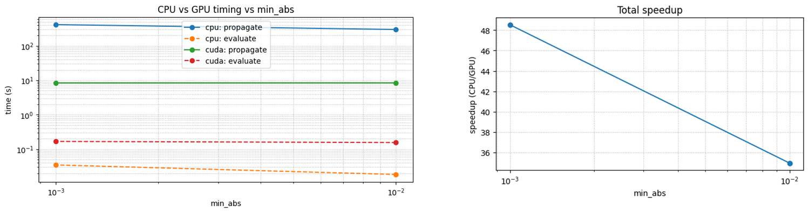

# Pauli Propagation Surrogate (Tensor)

## Overview
Prebuilt tensor backend for Pauli propagation surrogate.
This repo ships **precompiled wheels** in `dist/`.

## Requirements
- Python **3.10**
- Linux x86_64 (for provided wheel)
- CUDA 12.x (for GPU use)

## Environment Setup
```bash
conda env create -f environment_310.yml
conda activate ENV_310
```

## Install Wheel
```bash
pip install dist/pauli_propagation_surrogate_tensor-0.1.0-cp310-cp310-linux_x86_64.whl
```

## Verify Installation
After installing the wheel, verify the backend is working correctly:
```python
python -c "from src_tensor import _pps_tensor_backend; print('Backend loaded successfully!')"
```

If no errors occur, the installation is successful.

## Run Tutorial
To verify the full workflow, open and run `Tutorial.ipynb`.

Run all cells in order to confirm:
- Backend import succeeds
- Surrogate propagation runs
- Training loop completes
- (Optional) CPU/GPU timing comparison runs

**Important:** Make sure the correct kernel (conda environment) is selected in Jupyter.

## Project Structure
```
Pauli-propagation-surrogate/
├── README.md                    # This file (installation & usage)
├── IMPLEMENTATION_SUMMARY.md    # Technical documentation (developers)
├── LICENSE                      # GNU AGPLv3 license
├── environment_310.yml          # Conda environment (Python 3.10)
├── setup.py                     # Package configuration
├── MANIFEST.in                  # Distribution file rules
├── dist/                        # Prebuilt wheel files
│   └── pauli_propagation_surrogate_tensor-0.1.0-cp310-cp310-linux_x86_64.whl
└── Tutorial.ipynb               # Main tutorial notebook
```

**Note:** `src_tensor/` is **not** included in the repository. It is provided by the installed wheel package.

## Packaging & Distribution

This repository follows a **prebuilt-binary distribution model**:
- The compiled backend (`src_tensor._pps_tensor_backend*.so`) is included in official wheels
- Building from this repo alone produces a Python-only wheel (no backend) that will fail at runtime
- Wheels are **platform and Python-version specific** (e.g., `cp310` = Python 3.10)

For developers: see [IMPLEMENTATION_SUMMARY.md](IMPLEMENTATION_SUMMARY.md) for technical details.

## Notes
- This package does **not** compile C++ at install time
- If Python version differs, the wheel won't install
- Ensure you're **not** in the source directory when importing (avoids local `src_tensor` shadowing installed package)

## License
GNU AGPLv3 (see LICENSE)

## Copyright
Copyright (C) 2026 ys_lee@norma.co.kr

This program is licensed under the GNU Affero General Public License v3.0.
