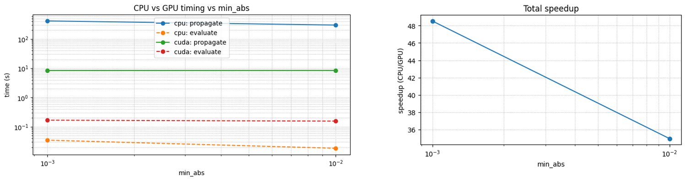
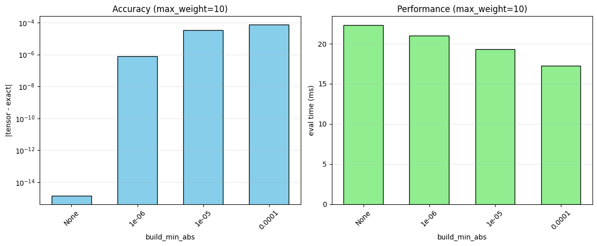
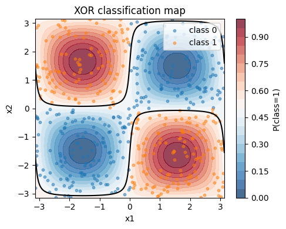
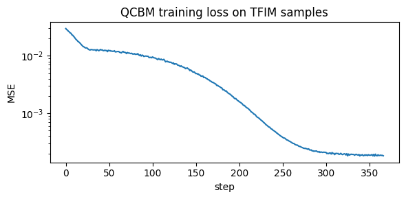
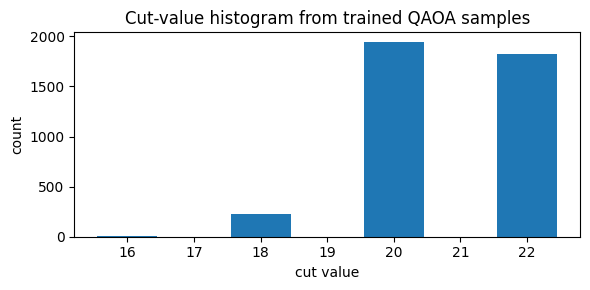

# PadoPauli - GPU-accelerated Pauli Propagation

**GPU-accelerated, differentiable Pauli Propagation surrogate with a compiled C++ / CUDA tensor backend.**



> **35–49× speedup** over CPU across a range of truncation settings (measured on medium-scale circuits; see Tutorial 01).

---

## What is this?

**Pauli Propagation** is a simulation methodology that works in the Heisenberg picture: instead of evolving a quantum state forward, it propagates observables *backward* through the circuit. Only terms that affect the measurement outcome are tracked, which eliminates redundant computation and makes repeated expectation-value evaluation fast.

**Pauli Propagation Surrogate (PPS)** extends this with controlled truncation strategies that bound the number of tracked terms at the cost of a tunable approximation error. This makes the approach practical for variational algorithms (VQE / QAOA) where you need to evaluate the same circuit structure thousands of times across different parameter values.

This repository implements PPS with:
- A **compiled C++ / CUDA backend** for high-throughput sparse tensor operations
- Native **PyTorch integration** for gradient-based optimization
- A clean **Python API** that compiles a circuit once and reuses it for many evaluations
- Support for **batched embedding inputs**, quasi-probability sampling, and multi-GPU workflows

---

## Why does it matter?

| Challenge | How PPS addresses it |
|---|---|
| Repeated circuit evaluation in VQE/QAOA is slow | Compile once, evaluate many times — surrogate reuse amortizes compilation cost |
| CPU-only simulation limits iteration speed | CUDA-backed sparse tensors exploit GPU parallelism |
| Existing GPU tools lack autodiff | Native PyTorch tensors flow through `.expvals(...)` |
| Term explosion at scale | Max-weight, coefficient, and max-XY truncation strategies bound growth |

Internal benchmarks show stable training and optimization on problems up to **35-qubit QAOA**.

---

## Quick Concepts

| Term | What it means |
|---|---|
| **Pauli string** | A tensor product like $X \otimes I \otimes Z \otimes X$ — a single term in an observable |
| **Pauli sum** | A weighted sum of Pauli strings representing a Hamiltonian or cost function |
| **Surrogate** | An approximation of the full propagation obtained by discarding small or high-weight terms |
| **Expectation value** | The scalar $\langle \psi \| O \| \psi \rangle$ optimized in variational algorithms |

---

## Truncation strategies

PPS controls approximation error by dropping terms during propagation:

| Knob | Effect |
|---|---|
| `max_weight` | Hard cap on Pauli operator count per term (limits exponential growth) |
| `build_min_abs` | Drop terms whose coefficient magnitude falls below this threshold |
| `build_min_mat_abs` | Drop terms by matrix-element magnitude during propagation |
| `weight_x` / `weight_y` / `weight_z` | Per-axis Pauli weights used to compute effective term weight (enables XY-biased truncation) |

Looser truncation → higher accuracy, slower evaluation. Tighter → faster, slightly less accurate.

> GPU memory pressure during evaluation is controlled separately via `chunk_size` in the preset.



*Tutorial 01: accuracy vs `build_min_abs` (left) and evaluation time (right) at `max_weight=10`. Coefficient truncation at `1e-5` achieves a useful speed reduction with error well below `1e-4`.*

---

## Requirements

- Linux x86\_64
- Python **3.11**
- CUDA 12.x (for GPU execution)
- PyTorch `2.2.0+cu121` (pinned in `requirements-tutorial.txt`)

---

## Installation

### Option A — helper script (recommended)

```bash
git clone <this-repo>
cd Pauli-Propagation---GPU-acceleration
./scripts/create_tutorial_conda_env.sh pps-tutorial
conda activate pps-tutorial
```

### Option B — manual

```bash
conda create -y -n pps-tutorial python=3.11 pip
conda activate pps-tutorial
pip install -r requirements-tutorial.txt
python -m ipykernel install --user --name pps-tutorial --display-name "PPS Tutorial"
```

### Verify

```bash
python -c "
import torch; print('PyTorch:', torch.__version__)
from src_tensor import _pps_tensor_backend_local; print('Backend: OK')
"
```

No errors → ready to go.

---

## Running the Tutorials

```bash
cd Pauli-Propagation---GPU-acceleration
jupyter lab
```

Run notebooks in numeric order from `Tutorial/`. Make sure the correct kernel (the conda env) is selected in Jupyter. Full scope and feature mapping are in [`Tutorial/README_TUTORIAL.md`](Tutorial/README_TUTORIAL.md).

---

## Tutorial overview

| # | Notebook | What you learn |
|---|---|---|
| 01 | `01_quickstart_gpu_basics.ipynb` | CPU vs GPU timing; accuracy vs `max_weight` and `build_min_abs` |
| 02 | `02_pennylane_reference_api.ipynb` | PennyLane reference path for expvals and sampling |
| 03 | `03_training_with_compiled_program.ipynb` | PyTorch training loop with `CompiledTensorSurrogate.expvals` |
| 04 | `04_embedding_batched_inputs_basics.ipynb` | Embedding + batched input: 1D regression, 2D classification, XOR |
| 05 | `05_preset_tuning_gpu_budget.ipynb` | Tuning presets with `resolve_preset` and `preset_overrides` |
| 06 | `06_quasi_probability_workflow.ipynb` | Moments and quasi-probability via `build_quasi_sampler` |
| 07 | `07_advanced_qcbm_tfim_ground_state.ipynb` | QCBM training on 1D TFIM ground-state samples |
| 08 | `08_advanced_maxcut_qaoa.ipynb` | MaxCut-QAOA: surrogate optimization + classical comparison + sampling |
| 09 | `09_gpu_multiprocessing_compile_benchmark.ipynb` | Parallel GPU compile benchmark (`parallel_compile=True/False`) |

---

## Results from the tutorials

### Quantum Machine Learning with embedding inputs (Tutorial 04)

The surrogate supports data embedding via `PauliRotation(..., embedding_idx=...)`. Training updates only the circuit parameters `thetas` while input data is passed as a separate `embedding` tensor — enabling quantum-native supervised learning.



*XOR classification: the circuit learns a nonlinear decision boundary entirely through gradient-based optimization on the surrogate.*

### QCBM training on TFIM ground-state samples (Tutorial 07)



*Quantum Circuit Born Machine (QCBM) trained to match the ground-state distribution of a 1D Transverse-Field Ising Model. MSE converges from ~10⁻² to ~5×10⁻⁴ over 370 steps.*

### MaxCut-QAOA optimization (Tutorial 08)



*Bit-string samples from the trained QAOA circuit concentrate at high cut values (20–22), consistent with near-optimal MaxCut solutions.*

---

## API reference

### Public API (`src_tensor.api`)

```python
from src_tensor.api import (
    compile_expval_program,   # compile circuit + observables → CompiledTensorSurrogate
    build_quasi_sampler,      # build a TensorSparseSampler for moment / quasi-prob workflows
    resolve_preset,           # look up and optionally override a named preset
    pennylane_reference,      # exact small-qubit reference (expvals + sampling)
    pennylane_reference_probs,# exact probability baseline via qml.probs
    pennylane_sample_small,   # exact small-qubit bitstring samples
)
```

#### Compile and evaluate

```python
from src_tensor.api import compile_expval_program
from src.pauli_surrogate_python import PauliRotation, CliffordGate, PauliSum

# 1. Define circuit and observable
circuit = [PauliRotation(...), CliffordGate(...), ...]
observable = PauliSum(...)

# 2. Compile once
program = compile_expval_program(circuit, [observable], preset="gpu")

# 3. Evaluate many times (returns a torch.Tensor)
expvals = program.expvals(thetas)                        # shape: (num_observables,)
expvals = program.expvals(thetas, embedding=emb_batch)  # shape: (batch, num_observables)
```

#### Preset tuning

```python
from src_tensor.api import resolve_preset

preset = resolve_preset("gpu", overrides={"max_weight": 8, "build_min_abs": 1e-6})
program = compile_expval_program(circuit, observables, preset=preset)
```

Built-in preset names: `"cpu"`, `"gpu"`, `"hybrid"`.

#### Quasi-probability sampling

`build_quasi_sampler` returns a `TensorSparseSampler` for computing moments and reconstructing quasi-probability distributions. See `Tutorial/06_quasi_probability_workflow.ipynb` for a full worked example.

### Circuit primitives (`src.pauli_surrogate_python`)

| Class | Description |
|---|---|
| `PauliString` | Single Pauli tensor-product term |
| `PauliSum` | Weighted sum of `PauliString` objects (observable / Hamiltonian) |
| `PauliRotation` | Parameterized rotation gate `exp(-i θ/2 P)` |
| `CliffordGate` | Clifford-class gate (e.g. H, CNOT, CZ) |
| `DepolarizingNoise` | Depolarizing noise channel |
| `AmplitudeDampingNoise` | Amplitude damping noise channel |

---

## Project structure

```
Pauli-Propagation---GPU-acceleration/
├── README.md
├── requirements-tutorial.txt        # pinned Python dependencies
├── scripts/
│   └── create_tutorial_conda_env.sh
├── img/                             # images (hero + tutorial results)
│   └── tutorial/
├── Tutorial/                        # Jupyter notebooks (01–09) + README
├── src/
│   └── pauli_surrogate_python.py    # circuit/observable primitives
└── src_tensor/
    ├── api.py                       # public compile / eval / sampler API
    ├── tensor_types.py              # tensor dataclasses
    ├── tensor_propagate.py          # propagation and pruning
    ├── tensor_eval.py               # sparse evaluation and chunking
    ├── tensor_adjoint.py            # union-basis utilities and expval assembly
    ├── tensor_sampler.py            # quasi-sampler helpers
    ├── tensor_propagate_impl.py     # compiled-backend import with fallback
    └── _pps_tensor_backend_local.so # compiled extension (not in repo, build locally)
```

---

## Practical tips

- **Start loose, then tighten**: use a lenient `build_min_abs` during early training; tighten it near convergence for speed.
- **Check the kernel**: always confirm the correct conda kernel is selected in Jupyter before running.
- **Rebuild the backend** after any Python or PyTorch version change: `python src_tensor/build_local_backend.py`.
- **`chunk_size`** controls GPU memory pressure during evaluation — reduce it if you run out of VRAM.

---

## Limitations

- Not a full statevector simulator — approximation error depends on truncation settings.
- The compiled backend `.so` is ABI-tied to the Python + PyTorch version in `requirements-tutorial.txt`.
- For hardware-level noise beyond the built-in channels, a separate noise model or hardware backend is required.

---

## References

- Quantum Surrogate Model overview: https://tzcjilwq.gensparkspace.com/
- Variational quantum eigensolver (VQE): https://en.wikipedia.org/wiki/Variational_quantum_eigensolver
- QAOA overview: https://en.wikipedia.org/wiki/Quantum_optimization_algorithms
- PennyLane QML learning hub: https://pennylane.ai/qml/

---

## License

GNU AGPLv3 — see [LICENSE](LICENSE).

## Copyright

Copyright (C) 2026 rnd@norma.co.kr, ys_lee@norma.co.kr, hw_kim@norma.co.kr


